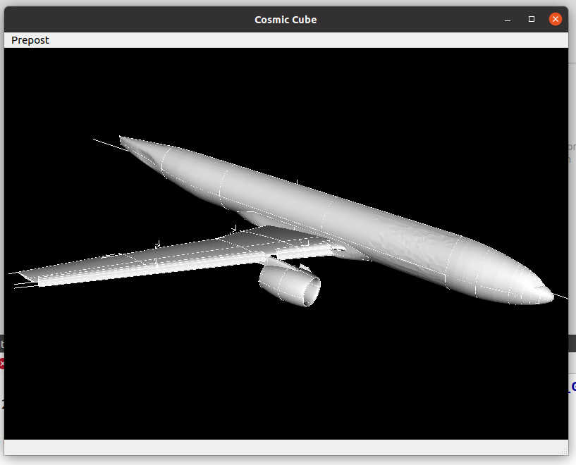

Figure and Reference Numbering
==========================================

Figure
------------------

.. _fig-1.3-1:

   图片编号案例

:numref:`fig-1.3-1` 是图片编号案例。

Reference
------------------

 :cite:`AsaroLubarda` 是索引编号案例。

索引见src中的refs.bib文件，如果索引编号无效可以修改下refs.bib文件重新make即可。
